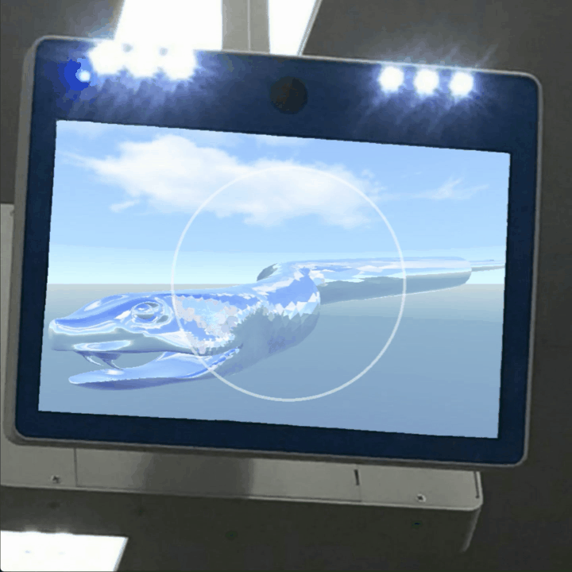

# CS557ProjectArchive
### Rachel Xing

<table>
    <tr>
        <td width="50%"><b style="font-size:20px">Preview</b></td>
        <td width="50%"><b style="font-size:20px">Project Description</b></td>
    </tr>
    <tr>
        <td width="50%">
            </td>
        <td width="50%">
            <b style="font-size:18px">Project #1: Step- and Blended-edged Elliptical Dots</b>
              
            <text style="font-size:16px">This project shows the use of GLSL vertex and fragment shaders to create a 
            repeating pattern of elliptical dots with blurrable edges on the surface of a 3D sphere.</text>
        </td>
    </tr>
    <tr>
        <td width="50%">
            </td>
        <td width="50%">
            <b style="font-size:18px">Project #2: Noisy Elliptical Dots</b>
              
            <text style="font-size:16px">
            This project implements a shader using a 3D noise texture to add noise to repeating elliptical dots with 
            blurrable edges on 3D models. The models, resembling a "Matryoshka doll" with nested spheres and a cup, 
            demonstrate the effects of reducing alpha or discarding the background color (hollow effects) and compare 
            noise indexing using 2D texture coordinates vs. 3D model coordinates. </text>
        </td>
    </tr>
    <tr>
        <td width="50%">
            </td>
        <td width="50%">
            <b style="font-size:18px">Project #3A&B: Displacement Mapping, Bump Mapping, and Lighting</b>
              
            <text style="font-size:16px"> This project implements a shader that applies displacement mapping and per-fragment
            lighting to turn a flat quad into a curtain with pleats and use bump mapping to introduce noises that can 
            create various texture effects on the curtain surface.  </text>
        </td>
    </tr>
    <tr>
        <td width="50%">
            </td>
        <td width="50%">
            <b style="font-size:18px">Project #4: Cube Mapping Reflective and Refractive Surfaces</b>
              
            <text style="font-size:16px"> This project implements a shader to simulate reflection and refraction effects 
            on a bump-mapped cow model in the Nvidia lobby using cube mapping. </text>
        </td>
    </tr>
    <tr>
        <td width="50%">
            </td>
        <td width="50%">
            <b style="font-size:18px">Project #5: Image Manipulation in a "Magic Lens"</b>
              
            <text style="font-size:16px"> This project implements a shader for a "magic lens" that can apply magnification, 
            whirl, and mosaic effects to the portion of a 2D image within the lens.  </text>
        </td>
    </tr>
    <tr>
        <td width="50%">
            </td>
        <td width="50%">
            <b style="font-size:18px">Project #6: The Snake Menagerie Project</b>
              
            <text style="font-size:16px"> This project implements a shader that renders a sidewinding snake with a 
            metallic texture in a blue sky scene using cube mapping. It features a magic lens that can transform the snake’s
            texture to a diamond-like appearance within the lens, allowing users to switch between diamond and metallic textures. 
            The entire view of the snake is displayed on a digital screen using a three-pass rendering and image manipulation techniques.  </text>
        </td>
    </tr>
    <tr>
        <td width="50%">
            </td>
        <td width="50%">
            <b style="font-size:18px">Project #7: The Snake Menagerie Project</b>
              
            <text style="font-size:16px"> This project implements a geometry shader that can transform the triangle mesh of a
            Dachshund dog model into a collection of 3D crosses using triangle subdivision and quantization, with a fragment 
            shader that can color the crosses based on its eye-coordinate depth using a rainbow color scale. </text>
        </td>
    </tr>
    <tr>
        <td width="50%">
            </td>
        <td width="50%">
            <b style="font-size:18px">Final Project: Realistic Water Simulation Shader</b>
              
            <text style="font-size:16px"> Thia project implements a water shader to simulate both the water surface and the
            underwater floor. In addition to simulating water waves using mathematical models, a caustic effect and foam 
            effect are added to enhance the realism of the rendering. </text>
        </td>
    </tr>
</table>